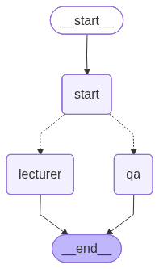
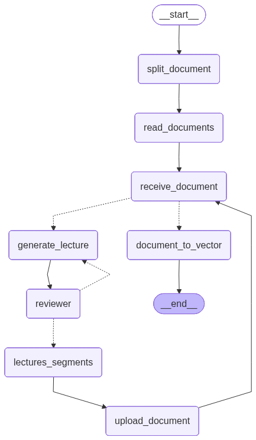
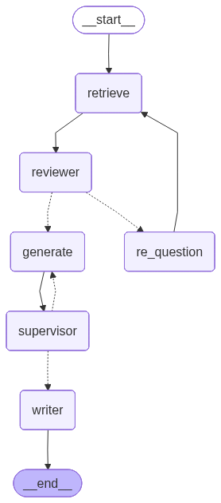

# AI_eLearning_Web

Một dự án mẫu bằng Python để xử lý file PDF thành slide, sinh lời giảng và hệ thống hỏi đáp dựa trên vectorstore.

## Mục đích
Ứng dụng này đọc tài liệu PDF (slide), tách từng trang thành file PDF riêng, dùng mô hình để sinh lời giảng cho mỗi trang, kiểm duyệt và phân đoạn nội dung, lưu vectorstore để hỗ trợ trả lời câu hỏi (QA). Có các agent chính: `lecturer` (tạo lecture, tách slide, upload), `qa` (truy vấn trả lời dựa trên vectorstore) và các agent phụ trợ (supervisor, reviewer, writer,...).

## Cấu trúc dự án (chính)

- `src/main.py` - entrypoint FastAPI, cấu hình middleware và đăng ký router.
- `src/api/` - các router API (lecturer, qa).
- `src/agents/` - logic agent: `lecturer`, `qa`, `assessment`, `state`, `workflow`.
- `src/config/setup.py` - nạp biến môi trường và cấu hình API keys.
- `src/data/` - nơi lưu `slide/` và `vectorstore/` (được cấu hình thông qua `DATA_DIR`).
- `requirements.txt` - danh sách phụ thuộc Python.

## Công nghệ sử dụng

Dự án sử dụng các công nghệ, framework và thư viện chính sau:

- Ngôn ngữ & runtime:
  - Python 3.9+ (repo yêu cầu Python 3.12+ theo README hiện tại; runtime tối thiểu có thể là 3.9+ tuỳ thư viện)

- Web & server:
  - FastAPI (API framework)
  - Uvicorn (ASGI server để chạy FastAPI)

- LLM / Embeddings / Orchestration:
  - LangChain / langchain-core (agent, prompt, runnable flow)
  - langchain-community (document loaders, vectorstore helpers)
  - langchain-google-genai (Google Generative AI Embeddings)
  - langsmith / langgraph (tracing, workflow helpers)

- Vector store & retrieval:
  - FAISS (`faiss-cpu`) để lưu và truy vấn vectorstore
  - Chromadb (nếu cần - có trong `requirements.txt`)

- Xử lý tài liệu / PDF:
  - PyPDF / pypdf (tách trang, đọc/ghi PDF)
  - PyPDFLoader (từ langchain_community) hoặc pymupdf (muPDF) cho các lựa chọn tải/đọc PDF

- Các thư viện tiện ích khác:
  - python-dotenv (tải biến môi trường từ `.env`)
  - pydantic (data models / validation)
  - cloudinary (upload file lên Cloudinary)
  - tavily-python (tùy cấu hình, có trong requirements)
  - TensorFlow / tf-keras (cần nếu sử dụng mô hình cục bộ trong một số flows)

Lưu ý: một số package (như `faiss-cpu`) có thể cần lưu ý cài đặt trên Windows — nếu gặp lỗi, cân nhắc dùng môi trường Linux hoặc WSL, hoặc cài phiên bản FAISS phù hợp.

## Yêu cầu môi trường

Cần Python 3.12+ (kiểm tra bằng `python --version`). Cài các phụ thuộc trong `requirements.txt`.

Biến môi trường cần thiết (có thể đặt trong `.env`):

- `GOOGLE_API_KEY` - API key dùng cho embedding (Google Generative AI Embeddings).
- `LANGSMITH_TRACING`, `LANGSMITH_ENDPOINT`, `LANGSMITH_API_KEY`, `LANGSMITH_PROJECT` - (tùy chọn) cấu hình Langsmith nếu dùng tracing/metadata.
- `TAVILY_API_KEY` - (nếu dùng) key cho Tavily.
- `CLOUDINARY_API_NAME`, `CLOUDINARY_API_KEY`, `CLOUDINARY_API_SECRET` - dùng để upload slide lên Cloudinary.
- `DATA_DIR` - thư mục gốc để lưu `slide/` và `vectorstore/`. Mặc định phải tồn tại hoặc được tạo tự động (ví dụ: `src/data`).

Tạo file `.env` ở root repo với nội dung ví dụ:

GOOGLE_API_KEY=your_google_api_key_here
LANGSMITH_API_KEY=your_langsmith_api_key_here
LANGSMITH_ENDPOINT=
LANGSMITH_PROJECT=
TAVILY_API_KEY=
CLOUDINARY_API_NAME=your_cloud_name
CLOUDINARY_API_KEY=your_cloudinary_api_key
CLOUDINARY_API_SECRET=your_cloudinary_api_secret
DATA_DIR=src/data

## Cài đặt

1. Tạo virtualenv và kích hoạt nó:

```pwsh
python -m venv .venv
.\.venv\Scripts\Activate.ps1
```

2. Cài các phụ thuộc:

```pwsh
pip install -r requirements.txt
```

3. Tạo file `.env` theo phần "Yêu cầu môi trường" ở trên.

## Chạy ứng dụng (phát triển)

Chạy FastAPI bằng `uvicorn` (từ root dự án):

```pwsh
uvicorn src.main:app --reload --host 0.0.0.0 --port 8000
```

Sau đó bạn có thể truy cập API trên `http://localhost:8000`.

## Luồng xử lý chính

- Graph flow:


- Lecturer flow:


  - Nhận file PDF (đường dẫn được cung cấp trong request), tách từng trang bằng `pypdf` và lưu vào `DATA_DIR/slide/{lesson_id}`.
  - Với mỗi trang, gọi prompt/model để sinh lời giảng (`prompt_lecturer_first` / `prompt_lecturer_continue`).
  - Dùng `Reviewer` để kiểm duyệt (có thể yêu cầu sinh lại nếu bị đánh giá là chưa đủ tốt).
  - Phân đoạn lecture (`LecturerSegmentAgent`) để tách thành các phần nhỏ.
  - Tạo vectorstore (FAISS) từ nội dung đã tách và lưu vào `DATA_DIR/vectorstore/{lesson_id}` để sử dụng cho truy vấn QA.
  - Upload từng slide (PDF) lên Cloudinary nếu cấu hình Cloudinary đầy đủ.

- QA flow:


  - Tải vectorstore (FAISS) từ `DATA_DIR/vectorstore/{lesson_id}`.
  - Lấy đoạn văn bản liên quan bằng retriever (k tìm kiếm top-k tương tự) và gọi mô hình để tạo câu trả lời.
  - Có các bước review/supervisor để kiểm tra và chỉnh sửa câu hỏi/đáp án.


## Gợi ý phát triển và kiểm thử

- Nếu gặp lỗi liên quan tới GPY hoặc FAISS, cân nhắc cài `faiss-cpu` phù hợp với hệ điều hành (Windows có thể khó cài một số bản). `requirements.txt` đã liệt kê `faiss-cpu`.
- Các prompt nằm trong `src/agents/*/prompt.py`. Bạn có thể điều chỉnh prompt để thay đổi cách mô hình sinh lecture/answer.

## Notes / Lưu ý

- File cấu hình API key được lấy từ `.env` thông qua `python-dotenv` (xem `src/config/setup.py`).
- `src/main.py` có middleware chặn các request có chuỗi nghi ngờ (wget, curl, rm, chmod, v.v.) — lưu ý khi thử nghiệm.
- Sau khi process xong, `LecturerAgent.process` cố gắng xoá file PDF gốc và thư mục slide tạm để dọn dẹp.

## Liên hệ
Nếu cần hỗ trợ, mở issue trên repository hoặc liên hệ tác giả dự án.

---
Tài liệu này được tạo tự động dựa trên mã nguồn hiện có. Nếu bạn muốn tôi mở rộng README (ví dụ: ví dụ request API, schema request/response cụ thể hoặc hướng dẫn deploy), cho biết chi tiết bạn muốn thêm.
